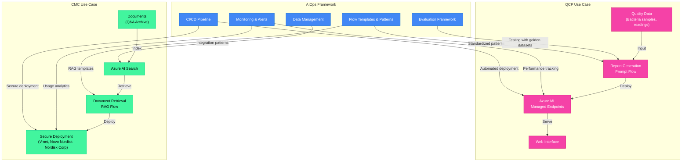

# AIOps Design for Gen AI Projects at Novo Nordisk 

## 1. Introduction & Purpose (Non-Technical)

* **What is AIOps?** A framework for bringing automation, consistency, and visibility to AI applications
* **Why does Novo Nordisk  Nordisk need it?** To standardize development approaches across projects like QCP and CMC
* **Business Value:**
  - Faster development cycles with standardized tools
  - Higher quality AI solutions through consistent evaluation
  - Lower maintenance costs through automation
  - Better visibility into AI application performance

## 2. Current AIOps Scope (What's In vs. Out)

**In Current Phase:**
* Prompt Flow orchestration (experiment, evaluate, deploy)
* CI/CD pipelines for automated testing and deployment
* Monitoring & alerting for deployed flows
* DataOps for preparing and registering data assets

**Not In Current Phase:**
* Model training and fine-tuning
* Custom RAG implementations beyond template

## 3. Ongoing Gen AI Projects & How AIOps Fits

**Quality Control Platform (QCP):**
* **Current State:** Development stage with manual data processing
* **Business Purpose:** Streamline quality control report generation
* **How AIOps Helps:**
  - Standardized prompt flows for consistent report generation
  - Automated testing with golden datasets
  - Reliable deployment pipeline via Azure DevOps
  - Performance monitoring and alerting

**Content Management & Compliance (CMC):**
* **Current State:** Implementation phase, RAG-based approach
* **Business Purpose:** Find relevant documents and generate summaries
* **How AIOps Helps:**
  - Ready-to-use RAG flow templates
  - Secure deployment within Novo Nordisk  Nordisk network
  - Integration patterns for Azure AI Search
  - Configurable data pipelines

## 4. AIOps High-Level Workflow (Simplified)

1. **Development:** Create and test prompt flows locally
2. **Quality Control:** Automated PR checks for code quality
3. **Deployment Pipeline:** 
   - Test flows against multiple datasets
   - Generate performance reports
   - Deploy to chosen target (Azure ML, Web Apps)
4. **Monitoring:** Track performance metrics and usage patterns

## 5. Implementation Roadmap & Next Steps

**Immediate Actions (Next 30 Days):**
* Complete AIOps pipeline setup for QCP use case
* Define standard metrics for flow evaluation
* Develop basic monitoring dashboards

**Medium-Term (60-90 Days):**
* Extend AIOps framework to CMC use case
* Implement enhanced security controls
* Create documentation and training materials

**Future Enhancements:**
* Databricks connectors for improved data integration
* Specialized RAG evaluation metrics
* Fine-tuning workflow support

## 6. Discussion & Q&A

* How does this align with your team's current development approach?
* What specific challenges would you like AIOps to address?
* What metrics would be most valuable for your use cases?