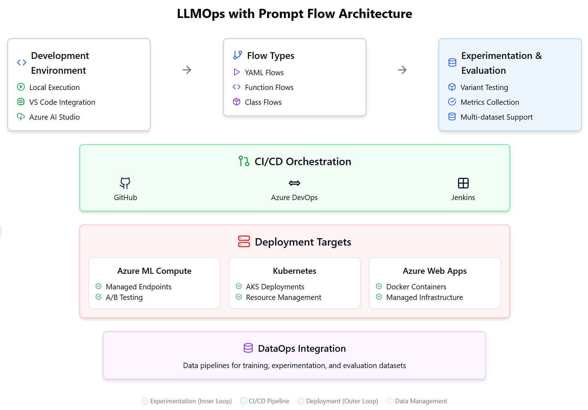

# LLMOps Architecture Diagram

This architecture supports both experimentation and deployment of large language model applications.

## Key Components of the LLMOps Architecture

Based on analyzing the repository, the architecture has the following major components:

1. **Development Environment**
   - Local execution capabilities with Python scripts
   - VS Code integration through extensions
   - Azure AI Studio-compatible workflows

2. **Flow Types**
   - YAML-based flows: Traditional DAG-based workflows (e.g., web_classification, named_entity_recognition)
   - Function-based flows: Python functions with prompt flow capabilities
   - Class-based flows: Python classes with more complex state management

3. **Experimentation & Evaluation (Inner Loop)**
   - Variant testing with multiple prompt configurations
   - Comprehensive metrics collection and reporting
   - Multi-dataset support for robust evaluation
   - A/B testing capabilities

4. **CI/CD Orchestration**
   - Support for GitHub Workflows
   - Azure DevOps pipeline integration
   - Jenkins pipeline support
   - Automated testing, evaluation, and deployment

5. **Deployment Targets (Outer Loop)**
   - Azure ML Compute with managed endpoints
   - Kubernetes deployments (including AKS)
   - Azure Web Apps using Docker containers
   - Support for A/B deployment strategies

6. **DataOps Integration**
   - Data pipeline management for creating datasets
   - Support for different data formats and sources
   - Integration with Azure ML data assets

## Architecture Benefits

This architecture provides several advantages for LLM application development:

1. **Complete Lifecycle Management**: Covers the entire spectrum from experimentation to production deployment

2. **Flexibility in Development**: Supports different types of flows to suit various use cases and developer preferences

3. **Robust Evaluation**: Comprehensive evaluation capabilities with multiple metrics and datasets

4. **Deployment Options**: Multiple deployment targets to meet different requirements (scalability, cost, performance)

5. **CI/CD Integration**: Automated workflows to ensure quality and speed up delivery

6. **Multiple Orchestration Options**: Support for different CI/CD platforms (GitHub, Azure DevOps, Jenkins)

This architecture enables organizations to implement a structured approach to developing, evaluating, and deploying LLM applications, making it easier to manage the complexities of working with large language models in production environments.